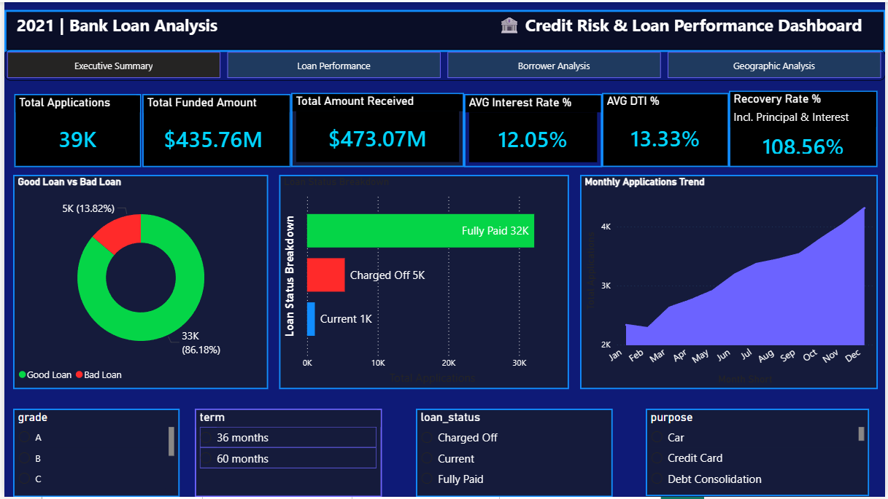
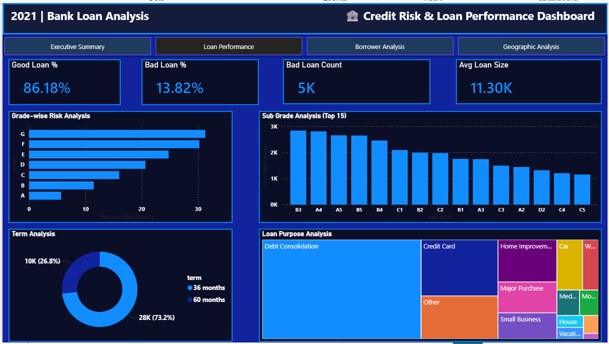
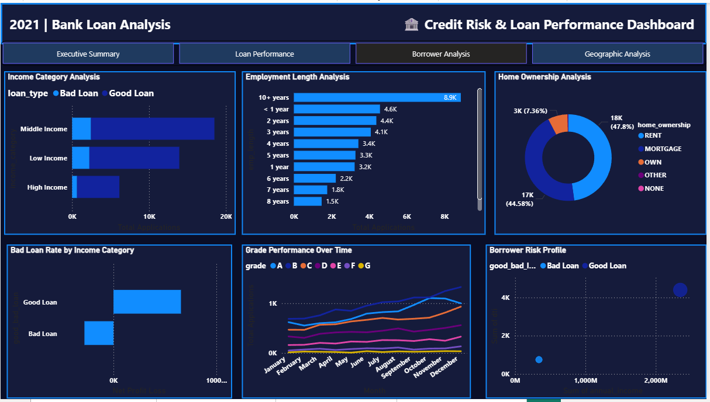
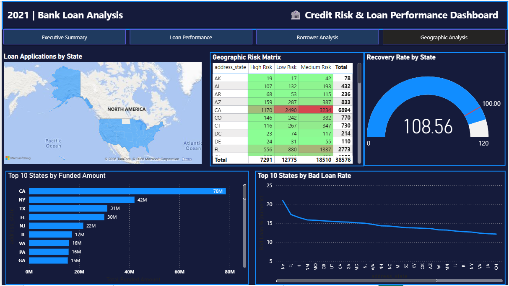

# 🏦 Credit Risk & Loan Performance Analysis Dashboard


An end-to-end data analytics project built using **Microsoft Excel, MySQL, and Power BI** to analyze **38,576 bank loan applications**, identify credit risk patterns, evaluate loan performance, and deliver actionable business insights through interactive dashboards.

---

## 📌 Project Overview

This project analyzes historical bank loan data to uncover borrower behavior, credit risk patterns, and loan portfolio performance. The interactive dashboard enables banking professionals to make data-driven decisions for loan approvals, risk management, and portfolio optimization.

---

## 🖼️ Dashboard Preview

### Executive Summary


### Loan Performance & Risk Analysis


### Borrower Analysis


### Geographic Analysis


---

## 🎯 Business Problem

Banks need to monitor their loan portfolios to:

- Identify high-risk borrowers before loan approval
- Track monthly loan performance trends
- Understand geographic distribution of loan defaults
- Optimize interest rates based on borrower risk profiles
- Maximize recovery rates while minimizing bad loans

---

## 🛠️ Tools & Technologies

| Tool | Purpose |
|------|---------|
| **Microsoft Excel** | Data cleaning, transformation & feature engineering |
| **MySQL Workbench** | Database creation, SQL analysis & KPI queries |
| **Power BI Desktop** | Interactive dashboard development & DAX measures |
| **GitHub** | Version control & project documentation |

---

## 📂 Project Structure

```text
credit-risk-loan-performance-analysis/
├── data/
│   ├── raw/
│   │   └── financial_loan_raw_data.xlsx
│   └── cleaned/
│       ├── financial_loan_cleaned.xlsx
│       └── financial_loan_cleaned.csv
├── sql/
│   └── bank_loan_analysis_queries.sql
├── powerbi/
│   ├── bank_loan_dashboard.pbix
│   └── bank_loan_dashboard.pdf
├── images/
│   ├── page1_executive_summary.png
│   ├── page2_loan_performance.png
│   ├── page3_borrower_analysis.png
│   └── page4_geographic_analysis.png
└── README.md
```

---

## 📊 Dataset Information

| Attribute | Details |
|-----------|---------|
| **Source** | Kaggle – Financial Loan Dataset |
| **Records** | 38,576 Loan Applications |
| **Features** | 26 (after cleaning & feature engineering) |
| **Time Period** | January 2021 – December 2021 |
| **Region** | United States (50 States) |

### Key Fields

- `loan_amount`
- `total_payment`
- `int_rate`
- `dti`
- `loan_status`
- `good_bad_loan`
- `grade`
- `sub_grade`
- `purpose`
- `address_state`

---

## 🧹 Data Cleaning & Feature Engineering

- Removed redundant columns
- Handled missing values
- Standardized text formatting
- Formatted date fields
- Converted interest rates into percentage format
- Verified duplicate records (0 duplicates found)
- Created four new analytical features:
  - Good/Bad Loan Classification
  - Income Category
  - Loan Size Category
  - DTI Risk Category

---

## 🗄️ SQL Analysis (36 Queries Across 5 Business Areas)

| Business Area | Queries |
|--------------|---------|
| KPI Analysis | 9 |
| Loan Performance | 7 |
| Risk Analysis | 6 |
| Borrower Analysis | 7 |
| Geographic Analysis | 7 |

### Key SQL Concepts Used

- Aggregate Functions (`COUNT`, `SUM`, `AVG`)
- Window Functions (`LAG`)
- Conditional Aggregation (`CASE WHEN`)
- `GROUP BY` & `HAVING`
- Date Functions
- Subqueries
- Common Business KPI Calculations

---

## 📈 Power BI Dashboard

### Page 1 – Executive Summary
- KPI Cards
- Good vs Bad Loan Analysis
- Loan Status Distribution
- Monthly Loan Trend

### Page 2 – Loan Performance & Risk Analysis
- Grade & Sub-grade Analysis
- Loan Purpose Analysis
- Loan Term Analysis
- Risk Distribution

### Page 3 – Borrower Analysis
- Income Category Analysis
- Employment Length
- Home Ownership
- Borrower Risk Profile

### Page 4 – Geographic Analysis
- US Filled Map
- Geographic Risk Matrix
- Recovery Rate Gauge
- State-wise Performance Analysis

---

## 🔍 Key Insights

### 📊 Portfolio Overview

| Metric | Value |
|--------|-------|
| Total Applications | 38,576 |
| Total Funded Amount | $435.76M |
| Total Amount Received | $473.07M |
| Recovery Rate | 108.56% |
| Average Interest Rate | 12.05% |
| Average DTI | 13.33% |

### ✅ Good vs Bad Loans

| Category | Value |
|----------|------:|
| Good Loans | 86.18% |
| Bad Loans | 13.82% |
| Net Profit (Good Loans) | +$65.5M |
| Net Loss (Bad Loans) | -$28.2M |

### ⚠️ Key Risk Findings

- Grade **G** borrowers recorded the highest default rate (**33%+**).
- Small Business loans showed the highest bad loan rate (**25.62%**).
- Nevada had the highest state-level bad loan rate (**20.95%**).
- 60-month loans carried higher interest rates due to increased credit risk.
- Verified borrowers showed a higher default rate than unverified borrowers.

### 🌍 Geographic Highlights

- California recorded the highest number of loan applications.
- Maine achieved the highest recovery rate.
- Texas maintained one of the lowest bad loan rates among high-volume states.

---

## 💡 Skills Demonstrated

- Data Cleaning & Transformation
- Feature Engineering
- SQL Query Writing
- Exploratory Data Analysis (EDA)
- DAX Measures
- KPI Development
- Dashboard Design
- Business Intelligence
- Data Visualization
- Business Storytelling

---

## 💼 Business Recommendations

- Strengthen approval criteria for **Grade G** borrowers.
- Closely monitor applicants with **high Debt-to-Income ratios**.
- Review lending strategies in states with consistently high default rates.
- Promote shorter loan terms where appropriate to reduce portfolio risk.
- Enhance borrower verification and credit quality assessment.

---

## 🎤 Technical Highlights

- Built **36 SQL queries** across five analytical domains.
- Used **LAG()** window function for Month-over-Month growth analysis.
- Applied **CASE WHEN** conditional aggregation for loan classification.
- Created **12+ DAX measures** for KPI reporting.
- Engineered **4 new analytical features** in Excel.
- Developed a **4-page interactive Power BI dashboard** with drill-down analysis.

---

## 🚀 Project Outcome

This project demonstrates an end-to-end data analytics workflow using **Excel, MySQL, and Power BI** to transform raw financial data into meaningful business insights. It showcases practical skills in data preparation, SQL analysis, KPI development, dashboard design, and business storytelling.

---

## 👩‍💻 Author

**Priyanka J**

📧 Email: **21priyankaj@gmail.com**

💼 LinkedIn: **https://linkedin.com/in/priyanka-jadhav-73a37a282**

🐙 GitHub: **https://github.com/Thepriyankaj**

---

## 📄 License

This project is intended for **portfolio and educational purposes only**.

Dataset Source: **Kaggle – Financial Loan Dataset**

---

⭐ **If you found this project helpful, please consider giving it a Star!**
